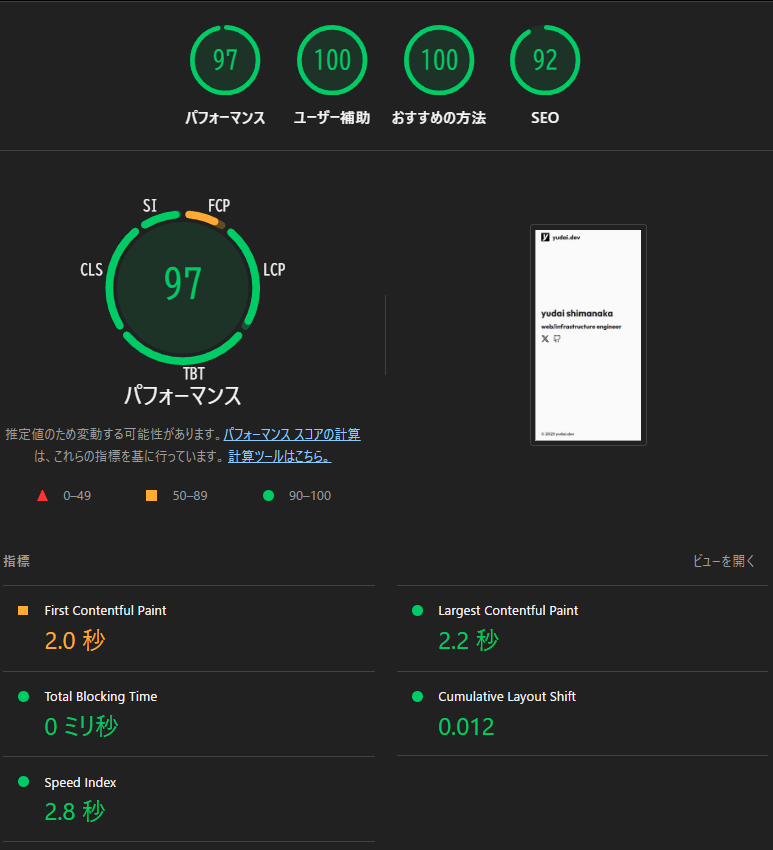
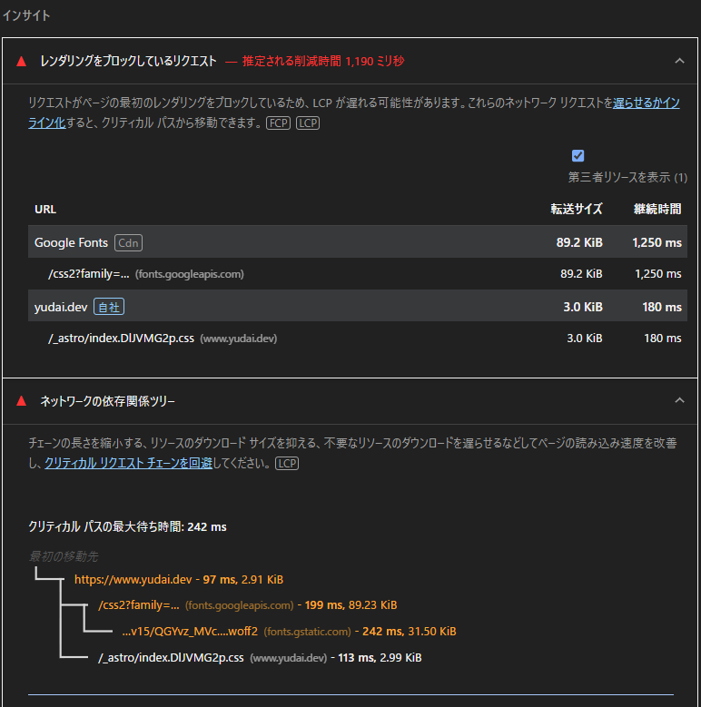

個人サイトをリニューアルした。  
これといった理由は特にないが、強いて言えば今後の活動に影響が出そうなので以前運用していた趣味寄りでキャッチーなデザインからの脱却。

構成はよくあるAstroサイト、Cloudflare PagesでホスティングしてGithubでコンテンツを管理、執筆にはObsidianを利用、pushの手間はあるがGithub上にすべてのコンテンツを保存できるので将来的に面倒くさくならないはず。

趣味で作成したコードは公開できそうだったらサイトのトップに掲載していくつもり、あとは気が向いたらnoteを書く、ゆるっとね。

後今回Astroで作成したサイトをLighthouseで分析してみたらパフォーマンススコア97だった  
First Contentful Paintって指標だけ微妙だったので、fontを非同期読み込みするか外部読み込みせずpublicとかに置いて参照すれば良くなると思う。  
SEO周りも頑張ってパフォーマンススコア99超えを目指すね。

